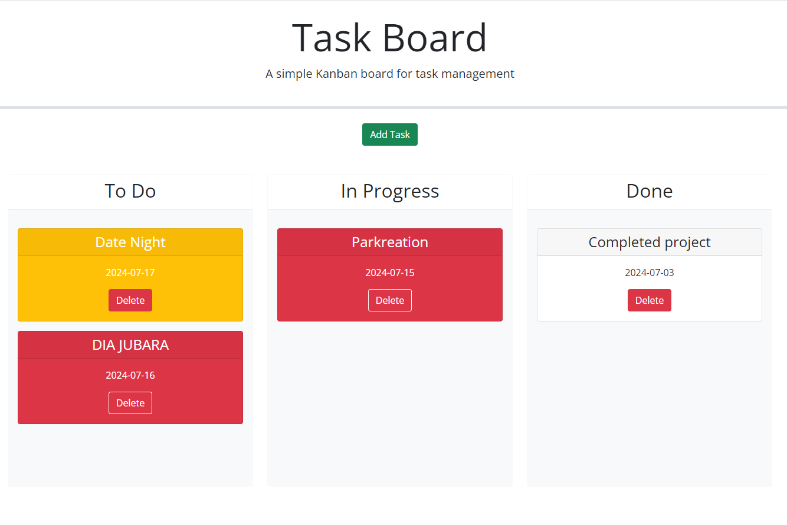

# Kanban-Like Task-Board

  >## Table of Contents

  1. [Description:](#description)
  2. [Installation:](#installation)
  3. [Usage:](#usage)
  4. [How to Contribute:](#how-to-contribute)
  
  6. [Test Instructions:](#test-instructions)
  7. [Questions:](#questions)

># User Story

```md
AS A project team member with multiple tasks to organize
I WANT a task board 
SO THAT I can add individual project tasks, manage their state of progress and track overall project progress accordingly
```

>## Acceptance Criteria

```md
GIVEN a task board to manage a project
WHEN I open the task board
THEN the list of project tasks is displayed in columns representing the task progress state (Not Yet Started, In Progress, Completed)
WHEN I view the task board for the project
THEN each task is color coded to indicate whether it is nearing the deadline (yellow) or is overdue (red)
WHEN I click on the button to define a new task
THEN I can enter the title, description and deadline date for the new task into a modal dialog
WHEN I click the save button for that task
THEN the properties for that task are saved in localStorage
WHEN I drag a task to a different progress column
THEN the task's progress state is updated accordingly and will stay in the new column after refreshing
WHEN I click the delete button for a task
THEN the task is removed from the task board and will not be added back after refreshing
WHEN I refresh the page
THEN the saved tasks persist
```

>## Description

  This app will run in the browser and it is a simple task board application that allows a team to manage project tasks.

> ## Screenshot

  
  
>## Installation

1. Clone the repository.
2. Install dependencies by typing `npm i` in the CLI.
3. Run `node index.js`

>## Usage

  Manage an employee database.
  
>## How to Contribute

  Create a pull request or raise an issue.

>## Test Instructions

  N/A
  
>## Questions

  If you have any question please visit my GitHub at [djubara](https://github.com/djub) or send me an email to: <djubara@hotmail.com>
